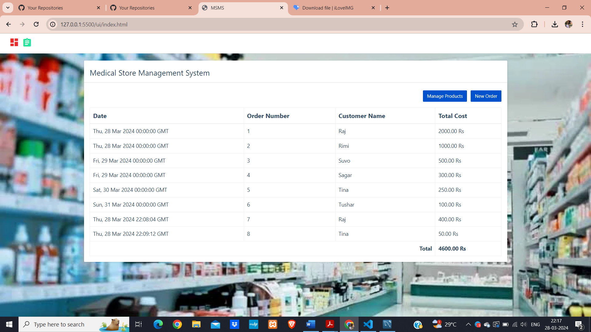

# python_projects_Medical_webapp
In this python project, we will build a medical store management application. It will be 3 tier application,
1. Front end: UI is written in HTML/CSS/Javascript/Bootstrap
2. Backend: Python and Flask
3. Database: mysql

### Installation Instructions

Download mysql for windows: https://dev.mysql.com/downloads/installer/

`pip install mysql-connector-python`

